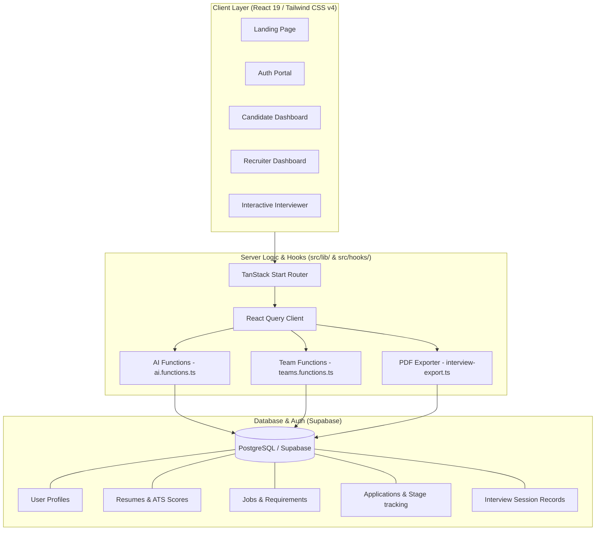

<div align="center">

# 📡 ADIKA AI

### Commercial-Grade AI-Powered Career Intelligence & Adaptive Interviewing Platform


---

### 🔍 Unified Intelligence Layer for Career Growth & Better Hiring Decisions

Adika AI is a state-of-the-art, production-quality career intelligence workspace and recruiter hiring suite. It bridges candidate career growth with advanced, adaptive AI mock interviews, automated resume parsing, ATS scoring, and real-time gap analysis—creating a premium, high-density dashboard experience.

</div>

---

# 📋 Table of Contents

- [Overview](#-overview)
- [Vision](#-vision)
- [Platform Modules](#-platform-modules)
  - [Candidate Workspace](#1-candidate-workspace)
  - [Recruiter Control Center](#2-recruiter-control-center)
  - [User Authentication & Roles](#3-user-authentication--roles)
- [System Architecture](#-system-architecture)
- [AI Services & Processing Pipeline](#-ai-services--processing-pipeline)
- [Database Schema Design](#-database-schema-design)
- [Tech Stack](#-tech-stack)
- [Getting Started & Installation](#-getting-started--installation)
- [Project Structure](#-project-structure)
- [Code Quality & Clean Architecture](#-code-quality--clean-architecture)
- [License](#-license)

---

# 🔍 Overview

**Adika AI** is an intelligence platform that streamlines career progression for candidates and hiring workflows for recruiters:
*   **Resume Intelligence & Tailoring** for grading resume details against any target Job Description (JD) and identifying matching keywords.
*   **Adaptive Mock Interviews** where the AI interviewer dynamically adjusts question difficulty based on prior answers, probing weaker skills and verifying strengths.
*   **Gap Analysis & Ramp Plans** to automatically design weekly study guides, helping candidates acquire missing skills mapped from application gaps.
*   **Structured Recruiter Dashboards** with pipeline status tracking, applicant comparisons, and exported technical performance logs.

---

# 🎯 Vision

> Provide an integrated career growth layer that empowers candidates to prepare and allows recruiters to find and verify the perfect talent with absolute clarity.

Designed for high density information environments, ensuring a premium user experience, professional typography, responsive grid layouts, and clean visual indicators.

---

# 🧩 Platform Modules

### 1. Candidate Workspace
A central hub for job seekers to monitor their readiness:
*   **Dashboard & Checklists**: Steps to guide candidates through uploading resumes, starting practice interviews, and applying for matches.
*   **Adaptive Interview Window**: A live chat interface that conducts technical mock interviews, providing real-time evaluation and hints.
*   **Resume Tailoring**: Deep alignment analysis highlighting matching key terms and missing competencies.
*   **Learning Roadmaps**: Automatically generated week-by-week study schedules with hand-picked resources to fill skill gaps.

### 2. Recruiter Control Center
A control tower to streamline applicant review:
*   **Hiring Dashboard**: Metrics showing active job posts, candidate volumes, and average interview readiness.
*   **Applicant Pipelines**: Kanban-style visual tracking (Applied, Review, Interview, Offered, Rejected) for candidate stages.
*   **Applicant Comparison Engine**: Side-by-side matrices matching top skills, ATS scores, match ratings, and AI observations.
*   **Interview Session Logs**: Transcripts and radar-chart evaluations measuring clarity, technical depth, and overall readiness.

### 3. User Authentication & Roles
*   **Dual-Role Support**: Custom portals separated by candidate and recruiter contexts, backed by Supabase Auth.
*   **Team Invitation Links**: Shareable custom invite tokens enabling collaborative hiring groups.

---

# 🏗 System Architecture



---

# 🤖 AI Services & Processing Pipeline

The project implements a state-of-the-art AI processing queue using the Google Gemini model (`google/gemini-3-flash-preview` via the Lovable API gateway) configured inside [src/lib/ai.functions.ts](file:///c:/Users/adity/Documents/GitHub/Adika-Ai-Interviewer/src/lib/ai.functions.ts).

| Server Function | Objective | Key Returns |
|---|---|---|
| `calculateMockAtsScore` | Grade candidate resumes against keyword density, experience quality, and structure | `number` (Capped at `94`) |
| `generateMockAtsFeedback` | Create structured recommendations for Resume sections (Summary, Experience, Education) | `{ name: string, score: number, tip: string }[]` |
| `generateInterviewQuestion` | Dynamically formulate next technical question using Gemini based on response history | `string` (Next Question) |
| `evaluateInterviewAnswer` | Grade technical depth, communication clarity, and candidate's answer | `{ score: number, signals: { clarity: number, technical: number, depth: number } }` |
| `performGapAnalysis` | Analyze candidate qualifications against a Job Description and design a study guide | `{ skills: Skill[], ramp_plan: RampItem[], resources: string[] }` |

---

# 🗄 Database Schema Design

Designed as a clean relational model optimized for complex career intelligence:

```
┌──────────────────┐      ┌──────────────────┐      ┌──────────────────┐
│     Profiles     │1    *│    User Roles    │      │ Recruiter Teams  │
│ (ID, Name, Email)├─────►│ (User_ID, Role)  │      │ (ID, Name, Owner)│
└────────┬─────────┘      └──────────────────┘      └────────┬─────────┘
         │1                                                  │1
         │                                                   │
         │* (Owner/Candidate)                                │*
┌────────▼─────────────────────────┐                ┌────────▼─────────┐
│             Resumes              │                │      Jobs        │
│(ID, UserID, ATS Score, Content)  │                │(ID, RecruiterID, │
└────────┬─────────────────────────┘                │ Skills, Status)  │
         │1                                         └────────┬─────────┘
         │                                                   │1
         │*                                                  │*
┌────────▼───────────────────────────────────────────────────▼─────────┐
│                               Applications                                │
│         (ID, JobID, CandidateID, ResumeID, Stage, MatchScore)             │
└──────────────────────────┬────────────────────────────────────────────────┘
                           │1
                           │*
┌──────────────────────────▼────────────────────────────────────────────────┐
│                            Interview Sessions                             │
│  (ID, JobID, CandidateID, RoleTarget, OverallScore, Readiness, Status)    │
└──────────────────────────┬────────────────────────────────────────────────┘
                           │1
                           │*
┌──────────────────────────▼────────────────────────────────────────────────┐
│                            Interview Messages                             │
│              (ID, SessionID, Role, Content, Score, Signals)               │
└───────────────────────────────────────────────────────────────────────────┘
```

---

# 🛠 Tech Stack

*   **Core**: [React 19](https://react.dev/), [TypeScript](https://www.typescriptlang.org/)
*   **Build & SSR Tool**: [Vite](https://vitejs.dev/) & [TanStack Start](https://tanstack.com/router/v1/docs/guide/start/overview)
*   **Routing**: [TanStack Router & Start](https://tanstack.com/router)
*   **Styling**: [Tailwind CSS v4](https://tailwindcss.com/), Radix UI Primitives, Lucide Icons
*   **Visualizations**: Recharts (for candidate analytics dashboards)
*   **Backend & DB**: [Supabase JS Client](https://supabase.com/) & PostgreSQL

---

# 🚀 Getting Started & Installation

### Prerequisites
*   [Node.js](https://nodejs.org/) (v18 or higher recommended)
*   [Bun](https://bun.sh/) (or `npm`)

### Installation Steps

1.  Clone the repository and navigate to the directory:
    ```bash
    git clone https://github.com/Adi3182004/adika-ai-interviewer.git
    cd adika-ai-interviewer
    ```

2.  Install dependencies:
    ```bash
    bun install
    # or
    npm install
    ```

3.  Configure Environment Variables:
    Create a `.env` file in the root directory:
    ```env
    VITE_SUPABASE_URL="your_supabase_project_url"
    VITE_SUPABASE_ANON_KEY="your_supabase_anon_key"
    ```

4.  Run the development server:
    ```bash
    bun run dev
    # or
    npm run dev
    ```

5.  Open your browser and navigate to `http://localhost:3000`.

---

# 📁 Project Structure

```text
├── .adika/                 # Adika platform settings & config
├── public/                 # Favicon & static assets
├── src/
│   ├── assets/             # Project visual resources (portrait, backgrounds)
│   ├── components/         # Global layout shells & visual wrappers
│   │   └── ui/             # Predefined UI components (buttons, charts, badges)
│   ├── hooks/              # Custom React hooks (e.g. mobile state detection)
│   ├── integrations/       # Supabase connections, client APIs & generated types
│   ├── lib/                # core logic, teams database management, and server functions
│   ├── routes/             # TanStack Start File-based Routing
│   │   ├── _authenticated/ # Protected Candidate & Recruiter portals
│   │   ├── auth.tsx        # Unified login & registration forms
│   │   ├── index.tsx       # Landing page containing features showcase
│   │   └── reset-password.tsx
│   ├── server.ts           # SSR server entry file
│   ├── start.ts            # Client bootstrap entry file
│   └── styles.css          # Tailwind CSS global styling definitions
├── supabase/               # SQL migrations and database configurations
├── package.json
└── vite.config.ts
```

---

# 🛡 Code Quality & Clean Architecture

Adika AI maintains strict separation of concerns to ensure stable production scaling:
*   **Server Function Decoupling**: API calls, LLM queries, and team setup are written as TanStack Server Functions under `src/lib/` to isolate server logic.
*   **Database Schema Mapping**: All relational tables, enums, and row shapes are strictly typed inside `src/integrations/supabase/types.ts`.
*   **Linter & Formatter Integrity**: Formatting is strictly verified via Prettier and ESLint settings.

---

# 📄 License

Adika AI is licensed under the [MIT License](LICENSE).
